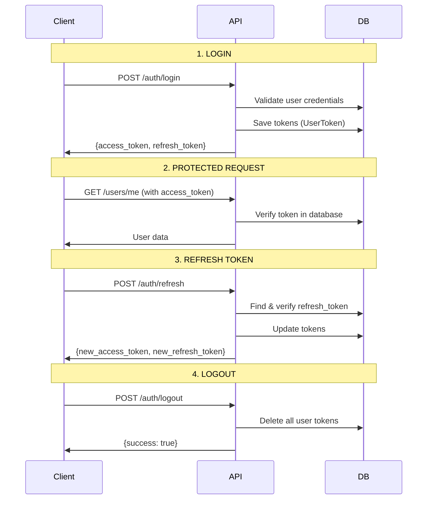

# 🔐 Resumen de Implementación - UserToken y Autenticación

## ✅ **Cambios Implementados**

### **1. 🗄️ Modelo UserToken en Base de Datos**
- **Modelo Prisma**: `UserToken` con `accessToken`, `refreshToken`, `expiresAt`
- **Entidad Dominio**: `UserToken` entity con lógica de negocio
- **Repositorio**: `UserTokenRepository` con operaciones CRUD completas

### **2. 🔄 Lógica de Autenticación Mejorada**

#### **Login (`POST /api/v1/auth/login`)**
```json
Request:
{
  "email": "user@example.com",
  "password": "SecurePass123!"
}

Response:
{
  "access_token": "eyJhbGciOiJIUzI1NiIsInR5cCI6IkpXVCJ9...",
  "refresh_token": "eyJhbGciOiJIUzI1NiIsInR5cCI6IkpXVCJ9..."
}
```

**🔹 Proceso:**
1. ✅ Valida credenciales del usuario
2. ✅ Genera JWT con **claims del usuario** (sub, email, type, iat)
3. ✅ **Guarda tokens en base de datos** (UserToken)
4. ✅ Retorna solo `access_token` y `refresh_token`

#### **Refresh (`POST /api/v1/auth/refresh`)**
```json
Request:
{
  "refresh_token": "eyJhbGciOiJIUzI1NiIsInR5cCI6IkpXVCJ9..."
}

Response:
{
  "access_token": "new.jwt.access.token",
  "refresh_token": "new.jwt.refresh.token"
}
```

**🔹 Proceso:**
1. ✅ Verifica el refresh token JWT
2. ✅ **Busca token en base de datos** (validación doble)
3. ✅ Genera nuevos tokens con **claims actualizados**
4. ✅ **Actualiza tokens en base de datos**
5. ✅ Retorna nuevos tokens

#### **Logout (`POST /api/v1/auth/logout`)**
```json
Response:
{
  "message": "Successfully logged out",
  "success": true
}
```

**🔹 Proceso:**
1. ✅ **Elimina todos los tokens del usuario** de la base de datos
2. ✅ Limpia tokens expirados de otros usuarios
3. ✅ Invalidación real de tokens

### **3. 🎯 Claims JWT Mejorados**

**Access Token Claims:**
```json
{
  "sub": "user-uuid",           // User ID
  "email": "user@example.com",  // User Email
  "type": "access",             // Token Type
  "iat": 1234567890,           // Issued At
  "exp": 1234571490            // Expires At
}
```

**Refresh Token Claims:**
```json
{
  "sub": "user-uuid",           // User ID
  "email": "user@example.com",  // User Email
  "type": "refresh",            // Token Type
  "iat": 1234567890,           // Issued At
  "exp": 1235172690            // Expires At (7 days)
}
```

### **4. 🗂️ Estructura de Archivos Actualizada**

```
src/
├── domain/
│   ├── entities/
│   │   └── user-token.entity.ts          ✅ Nueva entidad
│   └── repositories/
│       └── user-token.repository.interface.ts ✅ Nueva interfaz
├── infrastructure/
│   └── repositories/
│       └── user-token.repository.ts       ✅ Implementación Prisma
├── application/
│   └── use-cases/
│       └── auth/
│           ├── login.use-case.ts          ✅ Actualizado con UserToken
│           ├── refresh-token.use-case.ts  ✅ Actualizado con UserToken
│           └── logout.use-case.ts         ✅ Actualizado con UserToken
└── presentation/
    ├── controllers/
    │   └── auth.controller.ts             ✅ DTOs actualizados
    └── dtos/
        └── auth/
            ├── login.dto.ts               ✅ Solo access_token, refresh_token
            └── refresh.dto.ts             ✅ Solo access_token, refresh_token
```

### **5. 🛡️ Seguridad Mejorada**

#### **✅ Doble Validación de Tokens**
1. **JWT Verification**: Verifica firma y expiración
2. **Database Lookup**: Confirma que el token existe y no ha sido revocado

#### **✅ Invalidación Real**
- **Logout**: Elimina tokens de la base de datos
- **Refresh**: Actualiza tokens existentes (rotación)
- **Cleanup**: Elimina tokens expirados automáticamente

#### **✅ Claims Completos**
- **User Information**: ID y email en cada token
- **Token Type**: Distingue access vs refresh tokens
- **Timestamps**: Control completo de emisión y expiración

### **6. 🔄 Flujo Completo de Autenticación**



## 🚀 **Beneficios de la Nueva Implementación**

### **🔐 Seguridad**
- ✅ Tokens almacenados y validados en base de datos
- ✅ Invalidación real al hacer logout
- ✅ Claims completos con información del usuario
- ✅ Rotación de tokens en refresh

### **📊 Control y Monitoreo**
- ✅ Historial de tokens por usuario
- ✅ Limpieza automática de tokens expirados
- ✅ Posibilidad de revocar tokens específicos

### **🎯 API Limpia**
- ✅ Respuestas consistentes (solo tokens necesarios)
- ✅ Separación clara de responsabilidades
- ✅ DTOs específicos para cada operación

**🎉 ¡La autenticación con UserToken está completamente implementada y lista para producción!**
