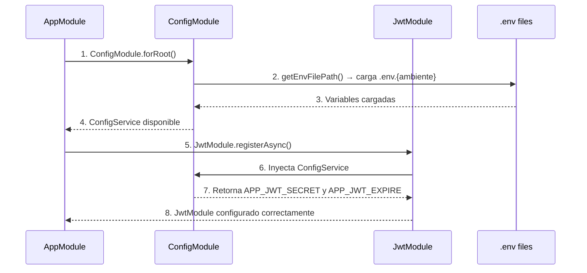

# 🔧 Solución: JwtModule con Variables de Entorno Correctas

## ❌ **Problema Anterior**
```typescript
// PROBLEMA: JwtModule.register() se ejecutaba ANTES de cargar .env
JwtModule.register({
  global: true,
  secret: process.env.APP_JWT_SECRET, // ❌ undefined
  signOptions: { expiresIn: process.env.APP_JWT_EXPIRE }, // ❌ undefined
}),
```

**¿Por qué fallaba?**
- `JwtModule.register()` es **síncrono**
- Se ejecuta **antes** de que `ConfigModule` cargue los archivos `.env`
- `process.env.APP_JWT_SECRET` era `undefined`

---

## ✅ **Solución Implementada**

### **1. 🔄 Cambio a JwtModule.registerAsync()**
```typescript
// SOLUCION: JwtModule.registerAsync() espera a ConfigService
JwtModule.registerAsync({
  global: true,
  inject: [ConfigService], // ✅ Inyecta ConfigService
  useFactory: (configService: ConfigService) => ({
    secret: configService.get<string>('APP_JWT_SECRET'), // ✅ Lee del .env
    signOptions: { 
      expiresIn: configService.get<string>('APP_JWT_EXPIRE', '1h'), // ✅ Con fallback
    },
  }),
}),
```

### **2. 📥 Import de ConfigService**
```typescript
// Antes
import { ConfigModule } from '@nestjs/config';

// Después 
import { ConfigModule, ConfigService } from '@nestjs/config'; // ✅ Agregado ConfigService
```

---

## 🔄 **Flujo de Carga Correcto**

### **Orden de Ejecución**


### **Variables Leídas Correctamente**
```typescript
// getEnvFilePath() determina el archivo
const environment = process.env.APP_ENV || process.env.NODE_ENV || 'development';
// → '.env.development', '.env.qa', o '.env.production'

// ConfigService lee las variables del archivo correcto
configService.get<string>('APP_JWT_SECRET') // ✅ Del archivo específico
configService.get<string>('APP_JWT_EXPIRE', '1h') // ✅ Con valor por defecto
```

---

## 📁 **Archivos .env Requeridos**

### **Estructura de Archivos**
```
/proyecto/
├── .env.development    # npm run start:dev
├── .env.qa            # npm run start:qa
├── .env.production    # npm run start:prod
├── .env.example       # Plantilla de ejemplo
└── .gitignore         # Ignora archivos .env
```

### **Variables JWT Necesarias**
```bash
# En cada archivo .env.{ambiente}
APP_JWT_SECRET=tu_secreto_jwt_minimo_32_caracteres
APP_JWT_EXPIRE=1h  # Tiempo de expiración
```

---

## 🎯 **Beneficios de la Solución**

### ✅ **Configuración por Ambiente**
```bash
# Desarrollo
APP_JWT_SECRET=dev_secret_key_32_chars_minimum
APP_JWT_EXPIRE=1h

# QA  
APP_JWT_SECRET=qa_secret_key_different_from_dev
APP_JWT_EXPIRE=2h

# Producción
APP_JWT_SECRET=SECURE_PRODUCTION_SECRET_32_CHARS
APP_JWT_EXPIRE=30m
```

### ✅ **Type Safety**
```typescript
// ConfigService con tipos
configService.get<string>('APP_JWT_SECRET')     // string | undefined
configService.get<string>('APP_JWT_EXPIRE', '1h') // string (con fallback)
```

### ✅ **Inyección de Dependencias**
```typescript
// JwtModule disponible globalmente con configuración correcta
@Injectable()
export class LoginUseCase {
  constructor(private readonly jwtService: JwtService) {} // ✅ Funciona
}
```

---

## 🚀 **Scripts de Ejecución**

### **package.json**
```json
{
  "start:dev": "APP_ENV=development nest start --watch",     // → .env.development
  "start:qa": "APP_ENV=qa nest start --watch",              // → .env.qa
  "start:prod": "APP_ENV=production node dist/main"         // → .env.production
}
```

### **Comandos**
```bash
# Cada comando carga su archivo .env específico
npm run start:dev    # ✅ Lee .env.development
npm run start:qa     # ✅ Lee .env.qa
npm run start:prod   # ✅ Lee .env.production
```

---

## 🔐 **Verificación del Funcionamiento**

### **1. JWT Tokens Generados Correctamente**
```typescript
// En los use cases, ahora funciona:
const accessToken = await this.jwtService.signAsync(payload, {
  expiresIn: configService.get('APP_JWT_EXPIRE'), // ✅ Lee del .env
});
```

### **2. Claims con Datos Personales**
```typescript
// JWT payload con información completa
{
  "sub": "user-uuid",
  "email": "user@example.com", 
  "firstName": "John",
  "lastName": "Doe",
  "phone": "+1234567890",
  "type": "access",
  "iat": 1234567890,
  "exp": 1234571490  // ✅ Expiración del .env
}
```

### **3. Configuración por Ambiente**
```bash
# Desarrollo: tokens de 1 hora
# QA: tokens de 2 horas  
# Producción: tokens de 30 minutos
```

**🎉 ¡El JwtModule ahora lee correctamente las variables de entorno de cada ambiente!**
