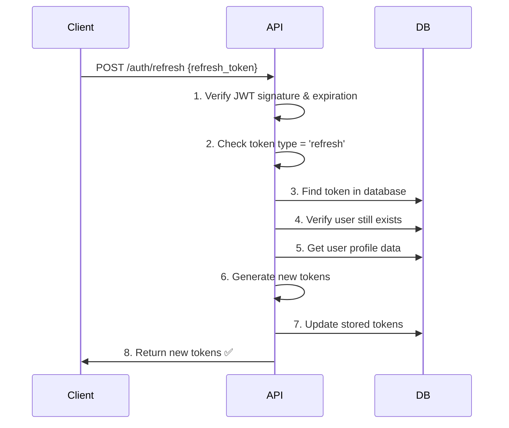

# 🔄 Troubleshooting: Refresh Token Issues

## ❌ **Error Observado**
```
[ERROR] UNAUTHORIZED: Invalid or expired refresh token
at AuthController.refreshToken (auth.controller.ts:103:15)
```

## 🔍 **Posibles Causas y Soluciones**

### **1. 🔐 JWT Secret No Configurado**
**Síntoma**: Error "JWT secret not configured"
**Solución**: Verificar que `APP_JWT_SECRET` esté en `.env.development`

```bash
# Verificar variable en .env.development
grep APP_JWT_SECRET .env.development
```

### **2. ⏰ Refresh Token Expirado**
**Síntoma**: Token válido pero expirado (> 7 días)
**Causas**:
- Token generado hace más de 7 días
- Reloj del sistema desincronizado

**Solución**: Generar nuevo refresh token haciendo login

### **3. 🔗 Token Mal Formateado**
**Síntoma**: Error de parsing JWT
**Causas**:
- Token truncado al copiar
- Caracteres especiales corrompidos
- Espacios extra en el token

**Verificación**:
```bash
# El refresh token debe empezar con 'eyJ'
echo "eyJhbGciOiJIUzI1NiIsInR5cCI6IkpXVCJ9..." | head -c 10
# Salida esperada: eyJhbGciOi
```

### **4. 🗄️ Token No Encontrado en Base de Datos**
**Síntoma**: "Token not found or expired" 
**Causas**:
- Token fue invalidado por logout
- Token no se guardó correctamente en la BD
- Problema de conexión a base de datos

**Solución**: Hacer login nuevamente para generar tokens frescos

### **5. 🔧 Secret Diferente en Generación vs Verificación**
**Síntoma**: Token técnicamente válido pero falla verificación
**Causas**:
- Diferentes variables `.env` cargadas
- Cache de configuración
- Reinicio necesario del servidor

**Solución**:
```bash
# Reiniciar servidor
npm run start:dev
```

---

## 🧪 **Pasos de Diagnóstico**

### **Paso 1: Verificar Configuración JWT**
```bash
# 1. Verificar variables en .env
grep -E "APP_JWT_" .env.development

# 2. Probar generación de token
curl -X GET http://localhost:3000/api/v1/debug/jwt-config
```

**Respuesta esperada**:
```json
{
  "jwtConfig": {
    "secretDefined": true,
    "secretLength": 36,
    "expireTime": "1h"
  },
  "testTokenGeneration": "SUCCESS"
}
```

### **Paso 2: Obtener Tokens Frescos**
```bash
# 1. Login para obtener tokens nuevos
curl -X POST http://localhost:3000/api/v1/auth/login \
  -H "Content-Type: application/json" \
  -d '{
    "email": "test@example.com",
    "password": "SecurePass123!"
  }'
```

**Guardar ambos tokens**:
- `access_token`: Para endpoints protegidos
- `refresh_token`: Para renovar el access token

### **Paso 3: Probar Refresh Token**
```bash
# Usar el refresh_token obtenido en el paso anterior
curl -X POST http://localhost:3000/api/v1/auth/refresh \
  -H "Content-Type: application/json" \
  -d '{
    "refresh_token": "REFRESH_TOKEN_AQUI"
  }'
```

**Respuesta esperada**:
```json
{
  "access_token": "nuevo.access.token",
  "refresh_token": "nuevo.refresh.token"
}
```

---

## 🔧 **Mejoras Implementadas**

### **1. Validación de JWT Secret**
```typescript
// En LoginUseCase y RefreshTokenUseCase
const jwtSecret = this.configService.get<string>('APP_JWT_SECRET');
if (!jwtSecret) {
  throw new Error('JWT secret not configured');
}
```

### **2. Manejo de Errores Mejorado**
```typescript
// En RefreshTokenUseCase
try {
  // ... lógica de refresh
  return { access_token, refresh_token };
} catch (error) {
  if (error instanceof UnauthorizedException) {
    throw error;
  }
  throw new Error('Invalid or expired refresh token');
}
```

### **3. Validaciones Adicionales**
```typescript
// Verificar tipo de token
if (decoded.type !== 'refresh') {
  throw new Error('Invalid token type');
}

// Verificar token en base de datos
const storedToken = await this.userTokenRepository.findByRefreshToken(token);
if (!storedToken) {
  throw new Error('Token not found or expired');
}
```

---

## 🚨 **Solución Rápida**

Si tienes problemas con refresh tokens:

### **Opción 1: Login Nuevamente**
```bash
# Más simple: hacer login para obtener tokens frescos
curl -X POST /auth/login -d '{"email":"tu@email.com","password":"tupassword"}'
```

### **Opción 2: Verificar Token Actual**
```bash
# Decodificar JWT para ver fecha de expiración
echo "TU_REFRESH_TOKEN" | cut -d. -f2 | base64 -d | jq .
```

### **Opción 3: Reiniciar Servidor**
```bash
# Si hay problemas de configuración
npm run start:dev
```

---

## 📚 **Flujo Correcto de Refresh**



---

## ✅ **Checklist de Verificación**

- [ ] Variables `APP_JWT_SECRET` y `APP_JWT_EXPIRE` en `.env.development`
- [ ] Servidor reiniciado después de cambios en `.env`
- [ ] Refresh token obtenido de login reciente (< 7 días)
- [ ] Token copiado completo (empieza con `eyJ`)
- [ ] Base de datos accesible y funcionando
- [ ] No hay espacios extra en el token
- [ ] Usuario existe y tiene perfil asociado

**🎯 Si sigues todos estos pasos, el refresh token debería funcionar correctamente.**
