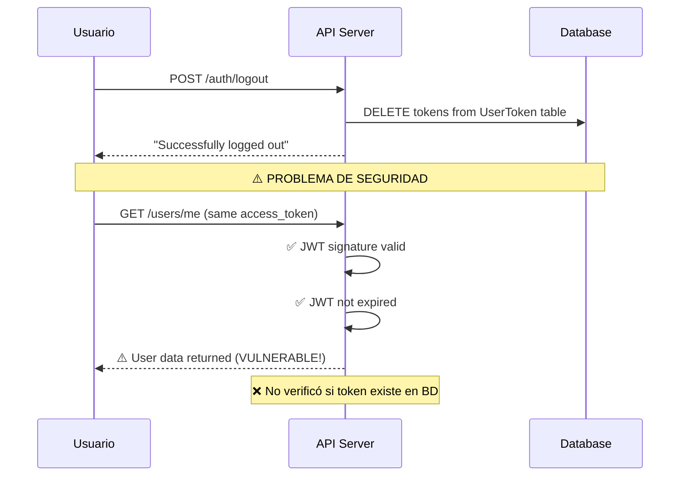
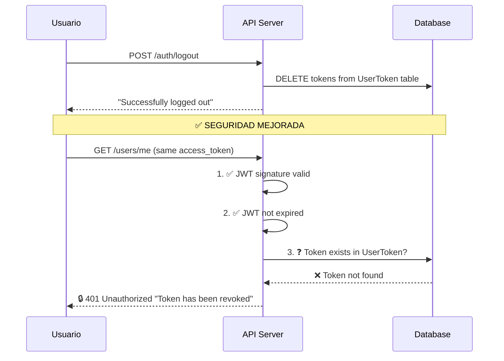
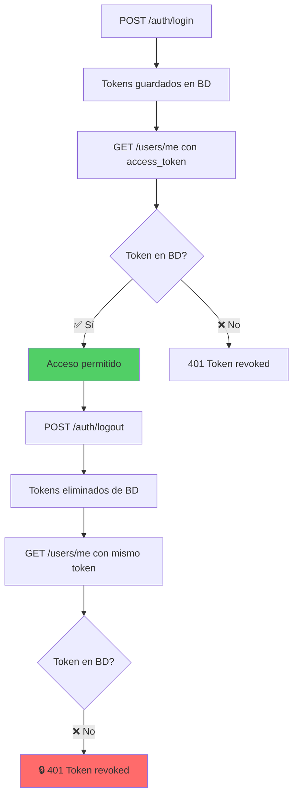

# 🔒 Fix de Seguridad: Token Revocation

## ❌ **Problema de Seguridad Identificado**

### **Comportamiento Inseguro Anterior**


### **Descripción del Problema**
- **Logout eliminaba tokens** de la tabla `UserToken` ✅
- **JwtAuthGuard solo verificaba**:
  - ✅ Firma JWT válida
  - ✅ Token no expirado
- **NO verificaba** si el token existe en la base de datos ❌
- **Resultado**: Tokens "revocados" seguían funcionando

---

## ✅ **Solución Implementada**

### **Nuevo Comportamiento Seguro**


### **JwtAuthGuard Mejorado**
```typescript
async canActivate(context: ExecutionContext): Promise<boolean> {
  // ... verificaciones anteriores

  // 1. Verify JWT signature and expiration ✅
  const payload = await this.jwtService.verifyAsync(token, { secret: jwtSecret });

  // 2. 🔒 NEW: Verify token exists in database (not revoked/logged out)
  const storedToken = await this.userTokenRepository.findByAccessToken(token);
  if (!storedToken) {
    throw new UnauthorizedException('Token has been revoked or expired');
  }

  // 3. 🔒 NEW: Verify token is still valid (not expired in database)
  if (storedToken.isExpired()) {
    throw new UnauthorizedException('Token has expired');
  }

  // 4. 🔒 NEW: Verify token type is access token
  if (payload.type !== 'access') {
    throw new UnauthorizedException('Invalid token type');
  }

  return true;
}
```

---

## 🛡️ **Capas de Seguridad Implementadas**

### **1. 🔐 Verificación JWT Tradicional**
- ✅ Firma criptográfica válida
- ✅ Token no expirado temporalmente
- ✅ Secret JWT correcto

### **2. 🗄️ Verificación en Base de Datos**
- ✅ Token existe en tabla `UserToken`
- ✅ Token no fue eliminado por logout
- ✅ Token no expiró según BD

### **3. 🎯 Verificación de Tipo**
- ✅ Solo tokens `access` en endpoints protegidos
- ✅ Tokens `refresh` solo para refresh endpoint

### **4. 🧹 Limpieza Automática**
- ✅ Logout elimina todos los tokens del usuario
- ✅ Cleanup automático de tokens expirados

---

## 🧪 **Pruebas de Seguridad**

### **Test 1: Token Después de Logout**
```bash
# 1. Login
curl -X POST /auth/login -d '{"email":"test@example.com","password":"SecurePass123!"}'
# → Guardar access_token

# 2. Verificar acceso inicial
curl -X GET /users/me -H "Authorization: Bearer ACCESS_TOKEN"
# → ✅ Datos del usuario

# 3. Logout
curl -X POST /auth/logout -H "Authorization: Bearer ACCESS_TOKEN"
# → ✅ "Successfully logged out"

# 4. Intentar acceso después de logout
curl -X GET /users/me -H "Authorization: Bearer ACCESS_TOKEN"
# → ❌ 401 "Token has been revoked or expired"
```

### **Test 2: Token Expirado en BD**
```bash
# Token válido en JWT pero expirado en BD
curl -X GET /users/me -H "Authorization: Bearer EXPIRED_DB_TOKEN"
# → ❌ 401 "Token has expired"
```

### **Test 3: Refresh Token en Endpoint Protegido**
```bash
# Usar refresh_token en lugar de access_token
curl -X GET /users/me -H "Authorization: Bearer REFRESH_TOKEN"
# → ❌ 401 "Invalid token type"
```

---

## 🔄 **Flujo de Autenticación Seguro**

### **Login → Access → Logout → Blocked**


---

## 📊 **Comparación: Antes vs Después**

| Aspecto | ❌ Antes | ✅ Después |
|---------|----------|------------|
| **Verificación JWT** | Solo firma y expiración | Firma, expiración + BD |
| **Logout efectivo** | ❌ Tokens seguían funcionando | ✅ Tokens realmente revocados |
| **Tokens expirados** | Solo verificación JWT | BD + JWT |
| **Tipo de token** | No verificado | ✅ Solo access tokens |
| **Seguridad** | ⚠️ Vulnerable | 🔒 Seguro |
| **Performance** | Más rápido | Ligeramente más lento (consulta BD) |

---

## ⚡ **Impacto en Performance**

### **Consulta Adicional por Request**
```sql
-- Nueva consulta en cada request protegido
SELECT * FROM UserToken 
WHERE accessToken = ? 
  AND expiresAt > NOW()
LIMIT 1;
```

### **Optimizaciones Aplicadas**
- ✅ Índice en `accessToken` (único)
- ✅ Índice en `expiresAt` 
- ✅ Query optimizada con LIMIT 1
- ✅ Cleanup automático de tokens expirados

### **Trade-off**
- **Costo**: +1 query SQL por request protegido
- **Beneficio**: 🔒 Seguridad real de revocación de tokens

---

## 🎯 **Casos de Uso Protegidos**

### **1. 🚪 Logout Real**
- Usuario hace logout → Token eliminado de BD
- Requests posteriores con ese token → 401

### **2. 🔄 Cambio de Contraseña**
- Al cambiar contraseña → Eliminar todos los tokens
- Forzar re-login en todas las sesiones

### **3. 👤 Sesiones Múltiples**
- Cada login genera tokens únicos
- Logout individual no afecta otras sesiones

### **4. 🛡️ Revocación de Emergencia**
- Admin puede eliminar tokens de un usuario
- Útil para suspensión de cuentas

---

## ✅ **Verificación de Seguridad**

### **Checklist de Seguridad**
- [x] Tokens eliminados en logout no funcionan
- [x] Tokens expirados en BD rechazan acceso
- [x] Solo access tokens en endpoints protegidos
- [x] Refresh tokens solo en /auth/refresh
- [x] Verificación doble: JWT + Base de datos
- [x] Mensajes de error informativos pero seguros

### **🔒 Resultado**
**¡Tokens realmente se revocan después del logout! La API ahora es segura contra el uso de tokens "fantasma".**
