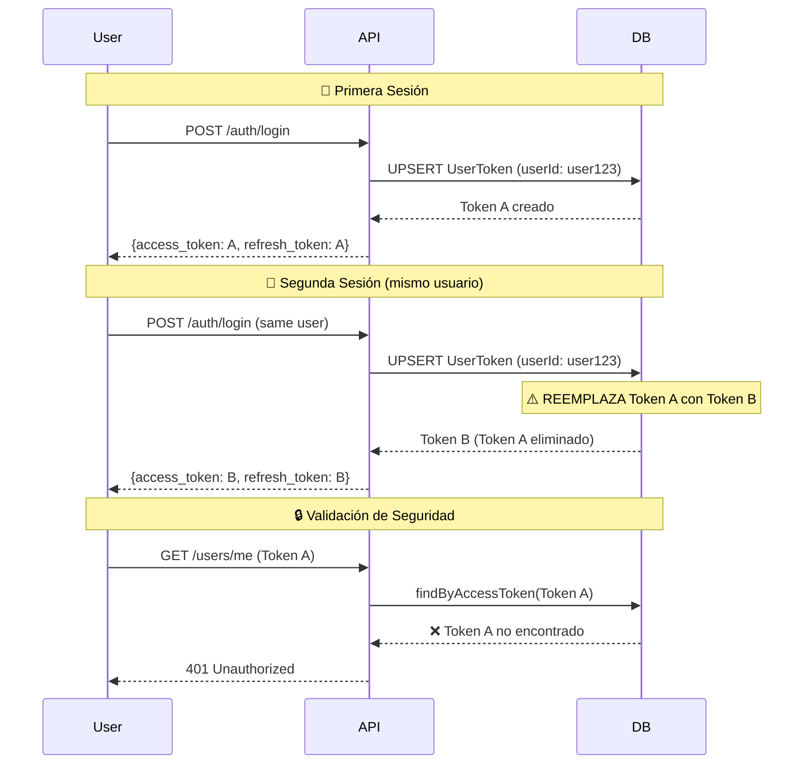

# 🔐 Fix Implementado: Un Solo Token Por Usuario

## ❌ **Problema Identificado**

### **Comportamiento Anterior (Problemático)**
```sql
-- UserToken tabla PERMITÍA múltiples registros por usuario
CREATE TABLE "UserToken" (
    "id" TEXT PRIMARY KEY,
    "userId" TEXT,  -- ❌ Sin unique constraint
    "accessToken" TEXT,
    "refreshToken" TEXT,
    "expiresAt" TIMESTAMP
);
```

### **Consecuencias del Problema**
- ✅ **Login 1**: Usuario hace login → Token A creado
- ✅ **Login 2**: Usuario hace login → Token B creado (**Token A sigue activo**)
- ❌ **Resultado**: Usuario tiene **múltiples tokens activos** simultáneamente
- 🚨 **Riesgo**: Tokens "olvidados" quedan activos por mucho tiempo

---

## ✅ **Solución Implementada**

### **1. 🗄️ Schema de Base de Datos Corregido**
```sql
-- UserToken tabla AHORA permite UN SOLO registro por usuario
CREATE TABLE "public"."UserToken" (
    "id" TEXT PRIMARY KEY,
    "userId" TEXT NOT NULL,  -- ✅ Con unique constraint
    "accessToken" TEXT NOT NULL,
    "refreshToken" TEXT,
    "expiresAt" TIMESTAMP(3) NOT NULL
);

-- ✅ Constraint único añadido
CREATE UNIQUE INDEX "UserToken_userId_key" ON "public"."UserToken"("userId");
```

### **2. 🔧 Repositorio Corregido**
```typescript
// UserTokenRepository actualizado para usar upsert por userId
async save(userToken: UserToken): Promise<UserToken> {
  const savedToken = await this.prisma.userToken.upsert({
    where: {
      userId: userToken.getUserId().getValue(), // ✅ Clave única
    },
    update: {
      accessToken: data.accessToken,     // 🔄 Actualiza token existente
      refreshToken: data.refreshToken,
      expiresAt: data.expiresAt,
      updatedAt: new Date(),
    },
    create: {
      id: userToken.getId(),
      ...data,                          // 🆕 Crea nuevo si no existe
    },
  });
  
  return this.toDomainEntity(savedToken);
}
```

### **3. 🔍 Método de Búsqueda Optimizado**
```typescript
// Ahora usa findUnique en lugar de findFirst + orderBy
async findByUserId(userId: UserId): Promise<UserToken | null> {
  const userToken = await this.prisma.userToken.findUnique({
    where: {
      userId: userId.getValue(), // ✅ Solo puede haber uno
    },
  });

  // Verificación de expiración en código
  if (userToken && userToken.expiresAt > new Date()) {
    return this.toDomainEntity(userToken);
  }

  return null;
}
```

---

## 🔄 **Nuevo Comportamiento (Correcto)**

### **Flujo de Login Mejorado**


### **Ventajas del Nuevo Sistema**
1. **🔐 Seguridad**: Solo una sesión activa por usuario
2. **🧹 Limpieza**: No acumulación de tokens antiguos
3. **💾 Eficiencia**: Menos registros en base de datos
4. **🎯 Simplicidad**: Una consulta directa por `userId`

---

## 🧪 **Testing del Comportamiento**

### **Test Script Creado**: `test_single_token_per_user.sh`

```bash
# Ejecutar test completo
chmod +x test_single_token_per_user.sh
./test_single_token_per_user.sh
```

### **Casos de Prueba**
1. **✅ Primera Sesión**: Login exitoso
2. **✅ Acceso Válido**: Token funciona correctamente
3. **🔄 Segunda Sesión**: Nuevo login del mismo usuario
4. **❌ Token Anterior**: Primer token YA NO funciona
5. **✅ Token Nuevo**: Segundo token SÍ funciona
6. **🚪 Logout**: Invalida token actual
7. **❌ Post-Logout**: Token invalidado no funciona

---

## 📊 **Comparación: Antes vs Después**

| Aspecto | ❌ Antes | ✅ Después |
|---------|----------|------------|
| **Tokens por usuario** | Múltiples ilimitados | Exactamente 1 |
| **Login nuevo** | Crea token adicional | Reemplaza token existente |
| **Seguridad** | Tokens "fantasma" activos | Solo un token válido |
| **Performance DB** | N registros por usuario | 1 registro por usuario |
| **Consultas** | `findFirst + orderBy` | `findUnique` |
| **Limpieza** | Manual | Automática |
| **Consistencia** | Inconsistente | Garantizada por DB |

---

## 🔧 **Cambios Técnicos Realizados**

### **1. 📋 Schema Prisma**
```diff
model UserToken {
  id           String @id @default(uuid())
- userId       String
+ userId       String @unique // ✅ Constraint único añadido
  user         User   @relation(fields: [userId], references: [id])
  
  accessToken  String
  refreshToken String?
  expiresAt    DateTime
  
  createdAt    DateTime @default(now())
  updatedAt    DateTime @updatedAt
}
```

### **2. 🗄️ Migración de Base de Datos**
```sql
-- Migración: 20250925192234_init
CREATE UNIQUE INDEX "UserToken_userId_key" ON "public"."UserToken"("userId");
```

### **3. 🏗️ Repositorio**
```diff
// UserTokenRepository.save()
const savedToken = await this.prisma.userToken.upsert({
  where: {
-   id: userToken.getUserId().getValue(),
+   userId: userToken.getUserId().getValue(),
  },
  update: { /* actualizar campos */ },
  create: { 
+   id: userToken.getId(),
    ...data 
  },
});
```

```diff
// UserTokenRepository.findByUserId()
- const userToken = await this.prisma.userToken.findFirst({
+ const userToken = await this.prisma.userToken.findUnique({
    where: { userId: userId.getValue() },
-   orderBy: { createdAt: 'desc' },
  });
```

---

## 🎯 **Beneficios Logrados**

### **🔒 Seguridad**
- **Una sola sesión activa** por usuario en cualquier momento
- **Tokens antiguos automáticamente invalidados** en nuevo login
- **Protección contra acumulación** de sesiones "olvidadas"

### **💾 Performance**
- **Menos registros** en tabla `UserToken`
- **Consultas más rápidas** usando `findUnique`
- **Menos mantenimiento** de tokens expirados

### **🧹 Mantenimiento**
- **Auto-limpieza** en cada login
- **Consistencia garantizada** por constraint de BD
- **Lógica simplificada** en el código

### **🎛️ Control de Sesiones**
- **Logout en un dispositivo** invalida la sesión globalmente
- **Cambio de contraseña** puede invalidar todos los tokens
- **Administración centralizada** de sesiones por usuario

---

## ✅ **Estado Final**

### **🔐 Comportamiento Garantizado**
```typescript
// 1. Solo UN token por usuario
const tokensCount = await prisma.userToken.count({
  where: { userId: "user123" }
});
// tokensCount === 0 || tokensCount === 1 (SIEMPRE)

// 2. Login nuevo reemplaza anterior
await loginUser("user123"); // Token A
await loginUser("user123"); // Token B (Token A eliminado)

// 3. Logout invalida completamente
await logout("user123");
const token = await findTokenByUserId("user123");
// token === null
```

### **🎯 Resultado**
**¡El sistema ahora mantiene exactamente UN TOKEN por usuario, garantizando seguridad y limpieza en la gestión de sesiones!**

---

## 🚀 **Próximos Pasos Opcionales**

### **Mejoras Adicionales Posibles**
1. **📱 Multi-Device Support**: Tokens por dispositivo
2. **⏰ Refresh Token Rotation**: Rotar refresh tokens
3. **📊 Session Analytics**: Tracking de sesiones
4. **🔔 Notifications**: Alertas de nueva sesión
5. **🎛️ Admin Panel**: Gestión de sesiones por admin

**Por ahora, el sistema está seguro y funcional con un token por usuario.**
