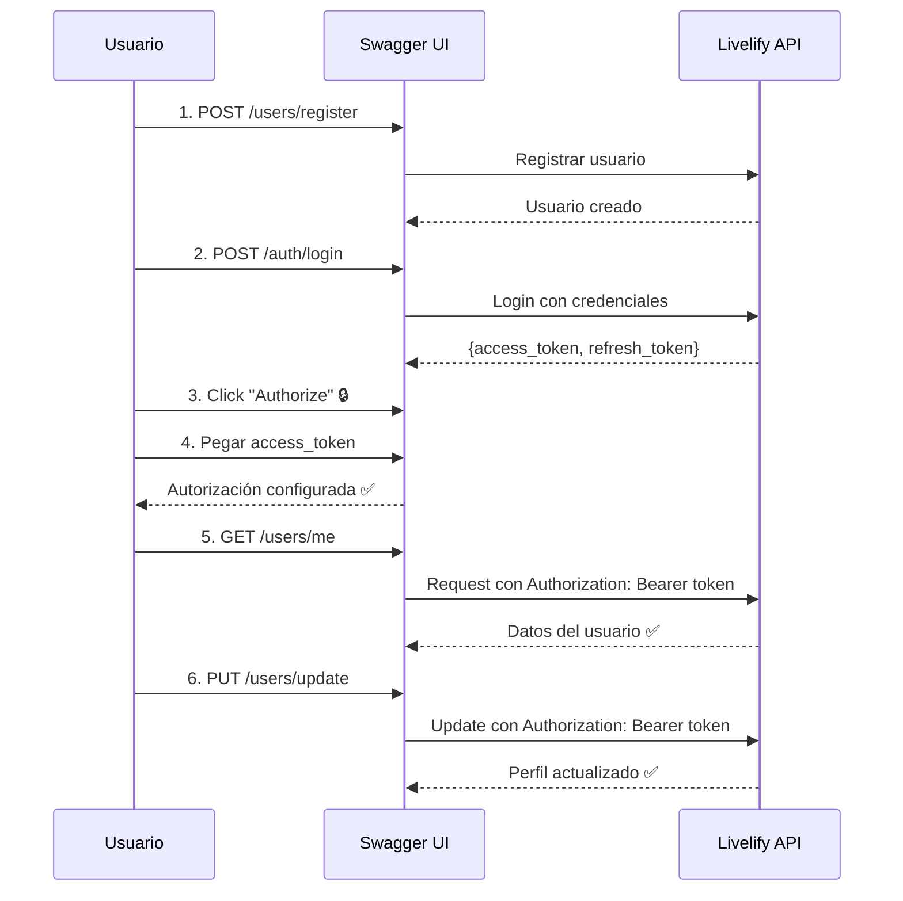

# 🔐 Guía: Cómo Usar Swagger con Autenticación JWT

## 🎯 **Problema Resuelto**
```json
{
  "message": "Access token is required",
  "error": "Unauthorized", 
  "statusCode": 401
}
```

**✅ Solución**: Configurar correctamente la autenticación Bearer en Swagger

---

## 🛠️ **Configuración Implementada**

### **1. 📝 Swagger Configuration (main.ts)**
```typescript
const config = new DocumentBuilder()
  .setTitle(TITLE)
  .setDescription(DESCRIPTION)
  .setVersion(VERSION)
  .addServer(`http://localhost:${PORT}/${GLOBAL_PREFIX}`, 'Development server')
  .addBearerAuth(
    {
      type: 'http',
      scheme: 'bearer', 
      bearerFormat: 'JWT',
      name: 'JWT',
      description: 'Enter JWT token',
      in: 'header',
    },
    'JWT-auth', // ✅ Nombre del esquema de auth
  )
  .build();
```

### **2. 🎚️ Swagger Options**
```typescript
SwaggerModule.setup(`${GLOBAL_PREFIX}/docs`, app, document, {
  customSiteTitle: TITLE,
  swaggerOptions: {
    persistAuthorization: true,    // ✅ Mantiene el token guardado
    tryItOutEnabled: true,         // ✅ Habilita "Try it out"
    displayRequestDuration: true,  // ✅ Muestra tiempo de respuesta
  },
});
```

### **3. 🔒 Controller Authorization**
```typescript
@ApiTags('Users')
@Controller('users')
@UseGuards(JwtAuthGuard)
@ApiBearerAuth('JWT-auth') // ✅ Referencia al esquema definido en main.ts
export class UserController {
  // endpoints protegidos...
}
```

---

## 🚀 **Cómo Usar Swagger para Probar la API**

### **Paso 1: 📧 Registrar Usuario**
1. Ve a Swagger UI: `http://localhost:3000/api/v1/docs`
2. Busca **`POST /users/register`** (endpoint público)
3. Click **"Try it out"**
4. Llena el JSON de ejemplo:
```json
{
  "email": "test@example.com",
  "password": "SecurePass123!",
  "firstName": "John", 
  "lastName": "Doe",
  "address": "123 Main St, City, Country",
  "phone": "+1234567890"
}
```
5. Click **"Execute"**

### **Paso 2: 🔑 Hacer Login**
1. Busca **`POST /auth/login`** (endpoint público)
2. Click **"Try it out"**
3. Llena el JSON:
```json
{
  "email": "test@example.com",
  "password": "SecurePass123!"
}
```
4. Click **"Execute"**
5. **COPIA** el `access_token` de la respuesta:
```json
{
  "access_token": "eyJhbGciOiJIUzI1NiIsInR5cCI6IkpXVCJ9...",
  "refresh_token": "eyJhbGciOiJIUzI1NiIsInR5cCI6IkpXVCJ9..."
}
```

### **Paso 3: 🔐 Autorizar en Swagger**
1. **Busca el botón "Authorize"** 🔒 en la parte superior derecha de Swagger
2. Click en **"Authorize"**
3. En el popup que aparece:
   - Campo **"Value"**: Pega **SOLO** el `access_token` (sin "Bearer")
   - Ejemplo: `eyJhbGciOiJIUzI1NiIsInR5cCI6IkpXVCJ9...`
4. Click **"Authorize"**
5. Click **"Close"**

### **Paso 4: ✅ Probar Endpoints Protegidos**
Ahora puedes usar cualquier endpoint protegido:

#### **`GET /users/me`** (Mi perfil)
1. Click **"Try it out"**
2. Click **"Execute"**
3. ✅ Debería devolver tu información de usuario

#### **`PUT /users/update`** (Actualizar perfil)
1. Click **"Try it out"**
2. Modifica los datos:
```json
{
  "firstName": "John Updated",
  "lastName": "Doe Updated", 
  "address": "456 New Street",
  "phone": "+1987654321"
}
```
3. Click **"Execute"**

#### **`POST /auth/logout`** (Cerrar sesión)
1. Click **"Try it out"**
2. Click **"Execute"**
3. ✅ Invalida todos los tokens del usuario

---

## 🔄 **Flujo Completo en Swagger**



---

## 🎯 **Endpoints Disponibles**

### **🔓 Públicos (Sin Auth)**
- `POST /users/register` - Registrar usuario
- `POST /auth/login` - Iniciar sesión  
- `POST /auth/refresh` - Renovar token

### **🔒 Protegidos (Con Auth)**
- `GET /users/me` - Mi perfil
- `PUT /users/update` - Actualizar mi perfil
- `POST /auth/logout` - Cerrar sesión
- `GET /users/:id` - Ver usuario por ID (admin)
- `PUT /users/:id/profile` - Actualizar perfil por ID (admin)

---

## 🚨 **Solución de Problemas**

### **❌ Error 401: "Access token is required"**
**Causa**: No configuraste la autorización en Swagger
**Solución**: Sigue el **Paso 3** de arriba

### **❌ Error 401: "Invalid token"** 
**Causa**: Token expirado o inválido
**Solución**: 
1. Haz login nuevamente (`POST /auth/login`)
2. Copia el nuevo `access_token`
3. Click "Authorize" y actualiza el token

### **❌ Error 401: "jwt must be provided"**
**Causa**: Token mal copiado
**Solución**: 
- Asegúrate de copiar **SOLO** el valor del `access_token`
- No incluyas comillas ni "Bearer "

### **❌ El botón "Authorize" no aparece**
**Causa**: Configuración de Swagger incorrecta
**Solución**: Verifica que `@ApiBearerAuth('JWT-auth')` esté en los controladores

---

## ⏱️ **Duración de Tokens**

### **Por Ambiente**
```bash
# Development (.env.development)
APP_JWT_EXPIRE=1h          # 1 hora

# QA (.env.qa)  
APP_JWT_EXPIRE=2h          # 2 horas

# Production (.env.production)
APP_JWT_EXPIRE=30m         # 30 minutos
```

### **Renovar Token Automáticamente**
```bash
# Cuando el access_token expire, usa:
POST /auth/refresh
{
  "refresh_token": "tu_refresh_token_aqui"
}
```

---

## 🎉 **¡Swagger Configurado Correctamente!**

### **✅ Características Habilitadas**
- 🔐 **Autenticación Bearer JWT**
- 💾 **Persistencia de autorización** (`persistAuthorization: true`)
- ⚡ **Try it out habilitado**
- ⏱️ **Duración de requests visible**
- 📝 **Documentación completa de endpoints**

### **🔒 Seguridad**
- Solo endpoints marcados con `@ApiBearerAuth('JWT-auth')` requieren auth
- Endpoints públicos (`@Public()`) funcionan sin token
- Tokens expiran según configuración del ambiente

**¡Ahora puedes probar toda la API desde Swagger UI sin problemas de autenticación! 🚀**
